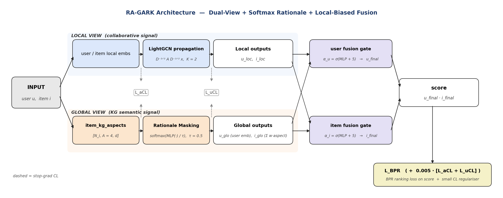

# RA-GARK 簡報內容

---

## Slide 1 — RA-GARK

**Rationale-Aware Gating over Review-Aspect Knowledge Graphs**
雙視角推薦：Softmax 面向顯著性注意力 ＋ 本地偏置融合閘

KG-aware Recommendation · 稀疏 KG · Graceful Degradation

---

## Slide 2 — Motivation

- **推薦系統近年主流：GNN-based 協同過濾**
  - LightGCN：線性傳播即可學到良好 user/item 表示
- **KG-aware 推薦目標：引入商品語意提升準確性**
  - 代表：KGAT、KGCL、MCCLK、KGRec
  - KG 豐富時通常優於純協同過濾 ✓
- **稀疏 KG 下：純 LightGCN 贏過所有 KG-aware 方法**
  - 深度融合將 KG 雜訊帶入 scoring

| 模型 | NDCG@20 |
|------|---------|
| MCCLK (2022) | 0.1067 |
| KGCL (2022) | 0.1073 |
| KGAT (2019) | 0.1079 |
| KGRec (2023) | 0.1095 |
| **純 LightGCN（無 KG）** | **0.1179** |

---

## Slide 3 — Research Question

**觀察引出的兩個問題：**

> **診斷（Why）**：為什麼 KG-aware 方法在稀疏 KG 上反而輸給純 LightGCN？它們的失敗模式是什麼？
>
> **處方（What）**：什麼樣的 KG 整合設計原則，能讓 KG 訊號在「有訊號」時被充分利用、在「噪聲」時不污染協同過濾？

**本文主張：**

- **KG 不應是 scoring 管線的必經成分**（如 KGAT-style 深度融入）
- **KG 應是一條可被顯式閘控的側通道**（side-channel with explicit gating）
- 三項設計體現此原則：**Softmax 面向挑選 · KG-SVD 初始化 · 本地偏置融合閘**

**我們將證明**：此原則能在稀疏 KG 下讓 KG 整合從 **net-negative 翻轉為 +13.1% 增益**。

---

## Slide 4 — Related Work: Graph-based CF — LightGCN

*He et al., 2020*

- **移除 GCN 的非線性激活與特徵轉換，僅保留線性鄰域聚合**
  - 傳播：E^(l+1) = ÷E^(l)，最終取各層均值
- 在多個 benchmark 上超越 NGCF，更簡潔、更穩定
  - SGL、NCL 等後繼方法在其上疊加對比學習

**本文的做法**

- **Local view 直接沿用 LightGCN（K=2），不做任何修改**
  - 有意保持協同訊號純淨，不疊加任何 KG 操作
- 純 LightGCN 在本文設定下即達 NDCG@20 = 0.1179，是強基準

---

## Slide 5 — Related Work: KG-aware Recommendation — KGAT

*Wang et al., 2019*

- **合併 user–item 圖與 KG 為 Collaborative Knowledge Graph（CKG）**
  - 在 CKG 上以 bi-interaction aggregator 傳遞，KG entity 嵌入直接參與 user/item 表示
- KG 豐富時效果顯著；KG 稀疏時雜訊也被深度融入 ✗
  - 本文設定：KGAT = 0.1079 < LightGCN = 0.1179

**本文的做法**

- **不合併 KG 與 user–item 圖；KG 走獨立側通道（global view），透過 fusion gate 後期合併**
  - 側通道設計在 KG 稀疏時提供更強容錯性，協同訊號梯度不直接受 KG 影響

---

## Slide 6 — Related Work: Contrastive KG Methods — KGCL & MCCLK

**KGCL (Yang et al., 2022)**

- 對 KG 做 relation-level 結構擾動，以 InfoNCE 做 cross-view 對比學習
- KG 豐富時大幅超越 KGAT
- KG 稀疏時擾動後剩餘結構不足以提供可靠監督 ✗
  - 本文設定：0.1073 < LightGCN 0.1179

**MCCLK (Zou et al., 2022)**

- 建立 collaborative / semantic / structural 三視角，所有 pairwise 組合互相對齊
- 多個資料集上達到 state-of-the-art
  - 本文設定：0.1067 < LightGCN 0.1179

**本文的做法**

- **同樣使用跨視角對比學習（L_aCL、L_uCL），但僅作輔助幾何對齊，權重極小（λ = 0.005）**
  - KG 側加 stop-gradient，避免 CL 梯度破壞 SVD 初始化的語意幾何

---

## Slide 7 — Related Work: Rationale-aware Methods — KGRec

*Yang et al., 2023*

- **首次提出 rationale-aware 推薦：並非所有 KG 邊同等重要，需顯式挑選「理由」**
  - 在每條 KG 邊計算 attention 重要性分數
  - 以 Bernoulli dropout 隨機移除高分邊，防止模型過度依賴少數主導邊
  - 透過原圖 vs. dropped 圖之間的對比學習強化穩健性
  - 建立在 KGAT-style aggregator 上，rationale 在 CKG 傳遞路徑中生效
  - 本文設定：KGRec = 0.1095 < LightGCN = 0.1179

**本文的四點調整**

| | 調整 |
|---|---|
| 粒度 | edge-level → item 的 aspect 槽（A=4），可直接解讀語意 |
| 機制 | 離散 Bernoulli dropout → 可微分 softmax attention，推論時可匯出權重 |
| 歸一化 | sigmoid → softmax + τ=0.5，差距達 −7.0% NDCG |
| 架構 | KGAT-integrated → LightGCN side-channel，稀疏 KG 下協同訊號更純淨 |

→ RA-GARK = 0.1238（+13.1% vs KGRec）

---

## Slide 8 — Related Work: Dual-View & Attention Normalization

**Dual-View Recommenders（SGL / DCCF 等）**

- 建立多視角並以對比學習對齊
  - 視角多為同一圖的不同擾動（同一訊號空間）
- **本文兩視角根本異質：行為 vs. 知識**
  - 需要 fusion gate 顯式控制混合比例，而非僅靠 CL 隱式對齊

**Attention Normalization（DIN / NAIS）**

| | Sigmoid | Softmax |
|---|---|---|
| 語意假設 | 各元素獨立 | 少數互相競爭 |
| 訓練行為 | 飽和均勻 | 具鑑別力 |
| 本文結果 | −7.0% NDCG | 最佳 |

**本文觀察**

- **Aspect 選擇語意 = 少數選項互相競爭 → softmax 符合需求**
  - sigmoid → softmax 差距：−7.0% NDCG（全文最大單項影響）
- 結論：歸一化方式應與 rationale 的語意假設明確對齊

---

## Slide 9 — Related Work: Summary

| 面向 | KGAT | KGCL | MCCLK | KGRec | **RA-GARK** |
|------|------|------|-------|-------|-------------|
| Local aggregator | Bi-interaction | KGAT-style | Multi-view | KGAT-style | **Pure LightGCN** |
| KG 整合方式 | 直接傳遞 | 傳遞+CL | 多視角CL | 傳遞+dropout | **閘控後期融合** |
| Rationale | — | — | — | Edge Bernoulli | **Aspect softmax** |
| NDCG@20 | 0.1079 | 0.1073 | 0.1067 | 0.1095 | **0.1238** |

- **RA-GARK 並非既有方法的「改進版」**
  - 而是在「保守 KG 整合」這條較少被探索的設計軸上的嘗試
- 優勢在稀疏 KG 設定下較為明顯；KG 豐富時，深度融合仍可能是更優選擇

---

## Slide 10 — Model Overview



**RA-GARK 四個模組**

- **① Local View：LightGCN（K=2），user–item 互動圖 → u_loc, i_loc**
  - 純協同訊號，不接觸 KG
- **② Global View：KG Aspect 表示，SVD init，Softmax Rationale → u_glo, i_glo**
  - A=4 個 aspect 槽，user-conditioned rationale 選擇
- **③ Fusion Gate：α·u_loc + (1−α)·u_glo，bias init = +5，α₀ ≈ 0.993**
  - 起點幾乎等同純 LightGCN；KG 無用時自動退化
- **④ Scoring：ŷ = u_final·i_final，BPR Loss + CL（λ=0.005）**

三項核心設計：KG-SVD 初始化 · Softmax Aspect-Saliency Attention · Local-Biased Fusion Gate Init

---

## Slide 11 — Preliminaries

**符號定義**

- U：使用者集合（N_u = 905）
- I：商品集合（N_i = 1,399）
- R：觀測正向互動（22,265 筆），以二部圖 G_UI 表示
- G_KG = (I, A_all, E_KG)：item–aspect 二部 KG
- |A_all| = 2,098 個獨立 aspect

**目標**

- 給定 (u,i)，學習評分函數 ŷ(u,i)
  - 使 (u,i⁺)∈R 的得分高於未觀測的 (u,i⁻)

**主要超參數**

| 超參數 | 值 |
|--------|-----|
| 嵌入維度 d | 128 |
| Aspect 槽數 A | 4 |
| LightGCN 層數 K | 2 |
| 學習率 η | 1e-3 |
| Batch size | 128 |

---

## Slide 12 — Local View: LightGCN Propagation

- **沿用標準 LightGCN，K=2 層線性傳播，不做任何修改**
  - 正規化鄰接：Ã = D^(−1/2) A D^(−1/2)
- 傳播規則：E^(l+1) = Ã · E^(l)
- 最終表示：E_loc = 1/(K+1) · Σ E^(l)，取出 u_loc、i_loc
- **不疊加任何 KG 操作，協同訊號保持純淨**
  - 任何 KG 整合皆在 global view 與 fusion gate 中進行，local view 不受影響

---

> 純 LightGCN 已達 NDCG@20 = 0.1179，高於所有 KG-aware baseline。「至少不應比 LightGCN 更差」成為架構設計的硬性約束。

---

## Slide 13 — Global View: KG-SVD Initialization

**多面向 Item 表示**

- 每個 item 維護 A=4 個 aspect 槽：item_kg_aspects ∈ R^(N_i × A × d)
- 允許 rationale 模組在 scoring 時動態選擇使用哪個面向

**初始化步驟**

1. 建立 IDF 加權矩陣 M ∈ R^(N_i × |A|)
   - M_ij = 1[a_j ∈ A_i] · IDF(a_j)
   - IDF(a) = log(N_i / |{i:a∈A_i}|+1) + 1
2. 截斷 SVD：M ≈ UΣV^T，目標維度 k = A×d = 512
3. E_init = U√Σ，reshape 為 [N_i,A,d]，縮放至 xavier-normal 標準差

**效果**

- **保留 KG 語意幾何作為訓練起點**
  - KG 相近的 item 在嵌入空間也較接近
  - BPR 訓練只需微調，而非從零學習結構
- 隨機初始化問題：必須從頭重建 KG 結構，訓練起點差
- **消融：改為隨機初始化 → −5.3% NDCG**

---

## Slide 14 — Global View: Softmax Aspect-Saliency Attention

```
ℓ = MLP([ u_glo ⊕ P_i ])  ∈ R^A
w = softmax( ℓ / τ ),   τ = 0.5
i_glo = Σ  w_a · P_i[a]
MLP：Linear(2d→d) → LeakyReLU → Linear(d→1)
```

**為何 softmax 而非 sigmoid？**

- Sigmoid：各 w_a 獨立，訓練中趨向均勻飽和 → 退化為 uniform mean ✗
- Softmax：Σw_a=1，強制競爭 → 具鑑別力的加權 ✓
- **Rationale 語意 = 少數選項互相競爭，softmax 符合需求**
- 消融：改為 sigmoid → −7.0% NDCG（全文最大單項影響）

**為何 τ = 0.5？**

- MLP logit 動態範圍小，τ=1 下 softmax 近似均勻分佈
- **τ=0.5 放大差異，產生清晰的 per-item aspect 偏好**
  - 掃描 τ ∈ {1.0, 0.5, 0.1, 0.05}，0.5 在 NDCG 最佳

---

## Slide 15 — Local-Biased Fusion Gate

```
α_u = σ( MLP_gate([ u_loc ⊕ u_glo ]) )
u_final = α_u · u_loc  +  (1 − α_u) · u_glo
MLP_gate：Linear(2d→d) → Tanh → Linear(d→1) → Sigmoid
```

**Bias 初始化為 +5**

- **α⁽⁰⁾ ≈ σ(+5) ≈ 0.993 → 訓練起點幾乎等同純 LightGCN**
  - global view 嵌入尚未成熟時，梯度不會干擾 local view
  - 梯度顯示 KG 有益時，α 才逐步下降納入 global 訊號
- **KG 無法提供有用訊號 → α 維持接近 1，自動退化為 LightGCN**
- **消融：bias 改為 0 → −5.3% NDCG**

**結構上的安全退化保證**

- 這不只是訓練技巧，而是架構層面的保證
- **RA-GARK 在最壞情況下不會比 LightGCN 更差**
- 對稀疏 KG 情境尤其重要

---

## Slide 16 — Cross-View Contrastive Regularization

目的：使 local 與 global 兩個嵌入空間幾何保持一致

```
Aspect-Level CL
  L_aCL = 1/A · Σ_a InfoNCE( g(i_loc⁺), stopgrad(P_{i⁺}[a]) )

User Cross-View CL
  L_uCL = InfoNCE( g(u_loc), stopgrad(u_glo) )

InfoNCE 溫度 τ_CL = 0.2，以 batch 內其他樣本作為負對
```

**三個保守設計**

- **Stop-gradient 在 KG 側：保留 SVD 初始化的語意幾何，CL 不反向拖動 KG 嵌入**
- **Projection head 分離（SimCLR 風格）：CL 梯度不直接影響 fusion gate 參數**
- **小權重 λ=0.005：CL 僅做輔助對齊，不主導表示學習**

```
L_total  =  L_BPR  +  0.005 · ( L_aCL + L_uCL )
```

---

## Slide 17 — Training Setup & Complexity

**優化設定**

- Adam，學習率 η = 1e-3，batch size 128
- Epochs 80，early stopping patience = 10
  - 以 validation NDCG@20 做 early stopping
  - 取最佳 epoch 的 test metrics 報告
- **每 epoch ≈ 1.5 秒（Nvidia RTX），與 KGRec 相近**

**複雜度**

| 組件 | 複雜度 |
|------|--------|
| LightGCN propagation | O(\|E_UI\|·d·K) |
| Rationale Masking | O(B·A·d)，A=4 可忽略 |
| Fusion gate | O(B·d²) |
| 推論全排序 | O(B·N_i·A·d) |

評估協議：Full-ranking，排除訓練集已互動 item。指標：HR、Precision、Recall、F1、MAP、NDCG，皆取 @K=20

---

## Slide 18 — Dataset & KG Construction

| 905 | 1,399 | 22,265 | 3,370 | 2,098 |
|-----|-------|--------|-------|-------|
| Users | Books | Interactions | KG Edges | Aspects |

**Review-Aspect KG 建構管線**（沿用自 [何宜霓等, 2024]，非本文貢獻）

| 步驟 | 做法 |
|------|------|
| 視覺特徵 | ResNet + Qwen-VL 為封面影像生成描述符 |
| 文本精煉 | BART / Mistral 將評論摘要為 unified summary |
| Aspect 抽取 | 從 summary 抽取 item–has_aspect–aspect 關係 |
| 前處理 | 移除高頻 2% aspect 詞 + 手動停用詞 |

- **原始 13,905 條邊 → 過濾後 3,370 條（−75.7%）**
  - 獨立 aspect 數：2,098 個；平均每本書 2.4 條邊
- User-stratified 70/15/15 切分，seed=42

---

## Slide 19 — Experimental Results

| 模型 | NDCG@20 | vs KGRec | vs LightGCN |
|------|---------|----------|-------------|
| MCCLK (2022) | 0.1067 | −2.6% | −9.5% |
| KGCL (2022) | 0.1073 | −2.0% | −9.0% |
| KGAT (2019) | 0.1079 | −1.5% | −8.5% |
| KGRec (2023) | 0.1095 | — | −7.1% |
| 純 LightGCN | 0.1179 | +7.7% | — |
| **RA-GARK** | **0.1238** | **+13.1%** | **+5.0%** |

**關鍵解讀**

- **+13.1% vs KGRec**：相同稀疏 KG 設定下，RA-GARK 的設計組合顯著優於現有最強 KG-aware 方法
- **+5.0% vs LightGCN**：更重要——KG 訊號在稀疏設定下從「無益」轉為「有益」
- 每 epoch ≈ 1.5 秒，計算成本與 KGRec 相當，未因新設計顯著增加負擔

---

## Slide 20 — Ablation Study

| 設定 | NDCG@20 | vs 完整 |
|------|---------|--------|
| RA-GARK（完整） | **0.1238** | — |
| w/o Softmax（改 sigmoid） | 0.1151 | **−7.0%** |
| w/o Local-Biased Init（bias=0） | 0.1173 | **−5.3%** |
| w/o KG-SVD Init（隨機初始化） | 0.1173 | **−5.3%** |
| 純 LightGCN（參照） | 0.1179 | — |

**重點解讀**

- **缺少任一設計，RA-GARK 均無法超越純 LightGCN（0.1179）**
- Softmax → sigmoid 的衰退（−7.0%）幾乎等同「使用 KG 反而有害」
- Local-Biased Init 與 KG-SVD Init 各自獨立貢獻 −5.3%，需同時使用才能達到最佳效果

---

## Slide 21 — Methodological Insight: Attention Normalization

| | Sigmoid | Softmax |
|---|---------|---------|
| 語意假設 | 各元素獨立評估重要性 | 少數選項互相競爭勝出 |
| 訓練行為 | 趨向飽和均勻，退化為 uniform mean | 產生具鑑別力的加權 |
| 適用場景 | 多個元素可同時重要 | 只有少數元素能主導 |
| 本文結果 | NDCG −7.0% | 最佳 |

- **本文 aspect 選擇語意 = 少數選項互相競爭 → softmax 符合需求**
- 差距 −7.0% NDCG，遠超一般調參所帶來的差異
- 不主張 softmax 普遍優於 sigmoid
- **結論：歸一化方式應與 rationale 的語意假設明確對齊**
  - 此差距在現有 rationale-aware 文獻中尚未被充分討論，值得後續研究驗證

---

## Slide 22 — Conclusion

**主要成果**

| 0.1238 | +13.1% | +5.0% |
|--------|--------|-------|
| NDCG@20 | vs KGRec | vs LightGCN |

**三項核心設計貢獻**

- **Softmax Aspect-Saliency Attention** → if removed: −7.0%
- **Local-Biased Fusion Gate Init（bias=+5）** → if removed: −5.3%
- **KG-SVD 初始化** → if removed: −5.3%
- 三者缺一，均無法超越純 LightGCN

**方法論觀察**

- 注意力歸一化（sigmoid vs. softmax）在 rationale 設計中影響顯著
  - 差距 −7.0%，現有文獻尚未充分討論
- 哪種 rationale 設計最適合哪類 KG，是值得持續探索的開放問題

**局限性**

- 僅在單一稀疏資料集驗證
  - KG 建構管線非本文貢獻
- §4.2–4.5 尚待補齊
- KG 豐富資料集上的泛化性有待驗證
