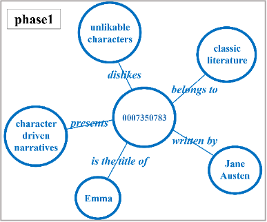
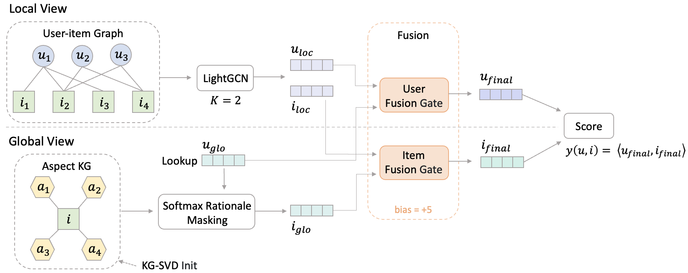

# RA-GARK：基於理由感知門控與稀疏評論面向知識圖譜之產品推薦

**Product Recommendation via Rationale-Aware Gating over Sparse Review-Aspect Knowledge Graphs**
國立陽明交通大學 資訊管理研究所 碩士論文

> **一句話摘要：** 當面向知識圖譜的品質不穩定時，RA-GARK 不會硬把它塞進推薦系統，而是用一個門控（Fusion Gate）讓模型自己學習：每一組「讀者 × 書」要參考多少面向知識圖譜的資訊。

| 目錄 | |
|---|---|
| 1. [什麼是面向知識圖譜](#1-什麼是面向知識圖譜) | 5. [結果](#5-結果) |
| 2. [問題](#2-問題面向知識圖譜太稀疏知識圖譜方法反而扣分) | 6. [限制](#6-限制) |
| 3. [方法與架構](#3-方法與架構) | 7. [如何執行](#7-如何執行) |
| 4. [程式碼導覽](#4-程式碼導覽依模型資料流順序) | |

---

## 1. 什麼是面向知識圖譜

**白話：** 讀者寫書評時，常會提到這本書的某個「面向」（aspect），例如角色、節奏、背景年代。把「書」和評論中提到的「面向」連起來，就是一張關係網，我們稱為**面向知識圖譜（Aspect KG）**。兩本書若連到相同的面向，就代表它們在讀者眼中有相似之處。



*示意：從評論中抽取的面向知識圖譜片段；模型使用書與面向之間的連結。*

**技術細節：**

| 項目 | 數值 |
|---|---|
| 資料來源 | Amazon Books 評論子集 |
| 讀者 / 書 | 905 / 1,399 |
| 正向互動 | 22,265 |
| 書—面向連結 | 3,370 條，分布在 2,098 個面向上 |
| 每本書平均面向數 | **2.4** |

- 模型只使用「書—面向」連結（[`data.py` L119–L123](https://github.com/beckyhsuxp/RA-GARK/blob/main/Code/data.py#L119-L123) 只讀取 `node_1` 書與 `node_2` 面向）；**關係類型不使用**（見 [`config.py` L60–L66](https://github.com/beckyhsuxp/RA-GARK/blob/main/Code/config.py#L60-L66) 的註解：relation type stripped）。
- 面向知識圖譜沿用既有研究的建構流程，本論文的貢獻在建模端。

---

## 2. 問題：面向知識圖譜太稀疏，知識圖譜方法反而扣分

**白話：** 每本書平均只連到 2.4 個面向，資訊很少，而且有些面向抽取得不準。結果是：四種主流的知識圖譜推薦方法，全都輸給**完全不用知識圖譜**的 LightGCN。

| 方法 | 是否使用面向知識圖譜 | NDCG@20 |
|---|:---:|---:|
| MCCLK | ✅ | 0.1037 |
| KGAT | ✅ | 0.1047 |
| KGCL | ✅ | 0.1058 |
| KGRec | ✅ | 0.1131 |
| **LightGCN** | ❌ | **0.1179** |

<sub>資料來源：[`Code/results/main_benchmark_results.csv`](Code/results/main_benchmark_results.csv) 的 `NDCG` 欄（K = 20）。</sub>

**原因：** 既有方法把面向知識圖譜直接接進評分流程，**不管面向準不準都照單全收，不會挑**。圖譜稀疏又有雜訊時，雜訊就會污染原本乾淨的協同過濾（Collaborative Filtering）訊號。

---

## 3. 方法與架構

**白話：** RA-GARK 有兩條路。上半部是「看大家買了什麼」的 LightGCN；下半部是「看這本書有哪些面向」的面向知識圖譜。最後由一個門控決定兩條路各聽多少。



| # | 元件 | 白話 | 技術細節 |
|---|---|---|---|
| 1 | **KG-SVD 初始化** | 先把每本書零散的面向，整理成 4 個代表性面向 | 書×面向矩陣 → IDF 加權 → Truncated SVD → 切成每本書 A = 4 個潛在面向槽位（latent aspect slots），不是 4 個固定標籤 |
| 2 | **Softmax 挑選面向**（Rationale-Aware Selection） | 依照這位讀者，挑出這本書最相關的面向 | MLP([讀者; 面向]) → Softmax（溫度 τ = 0.5）→ 4 個權重加總為 1，加權合併 |
| 3 | **Fusion Gate** | 決定兩條路各占多少；一開始幾乎只聽 LightGCN，面向知識圖譜有幫助時才逐步打開 | 輸出 α ∈ (0, 1)；最後一層 bias 初始 = 5 → α ≈ σ(5) ≈ 0.993 |

> 核心想法：**預設不信任面向知識圖譜**，讓訓練資料證明它有用時，模型才採用它。

---

## 4. 程式碼導覽（依模型資料流順序）

**白話：** 以下七步對應一筆「讀者 u × 書 i」從輸入到推薦分數的過程。

| 步驟 | 做什麼 | 程式碼 |
|---|---|---|
| ① 整體流程 | `forward` 串起全部步驟：上半部 → 下半部 → Gate → 分數 | [`model.py` L189–L220](https://github.com/beckyhsuxp/RA-GARK/blob/main/Code/model.py#L189-L220) |
| ② 上半部 LightGCN | 在讀者—書互動圖上傳播 2 層，取各層平均，得到 `u_loc`、`i_loc` | [`model.py` L180–L187](https://github.com/beckyhsuxp/RA-GARK/blob/main/Code/model.py#L180-L187) |
| ③ 下半部 KG-SVD 初始化 | 建書×面向稀疏矩陣、IDF 加權、SVD，重塑成 `[書數, 4, 維度]` 作為面向向量的初始值 | [`data.py` L160–L204](https://github.com/beckyhsuxp/RA-GARK/blob/main/Code/data.py#L160-L204) |
| ④ Softmax 挑選面向 | MLP 為每個面向打分，Softmax 轉成權重（L63–L66），再加權合併成 `i_glo`（L72–L74）；`forward` 呼叫處見 L202–L207 | [`model.py` L63–L66](https://github.com/beckyhsuxp/RA-GARK/blob/main/Code/model.py#L63-L66)、[L72–L74](https://github.com/beckyhsuxp/RA-GARK/blob/main/Code/model.py#L72-L74)、[L202–L207](https://github.com/beckyhsuxp/RA-GARK/blob/main/Code/model.py#L202-L207) |
| ⑤ Fusion Gate 結構 | 兩層 MLP，最後一層 bias 設為 5 | [`model.py` L77–L91](https://github.com/beckyhsuxp/RA-GARK/blob/main/Code/model.py#L77-L91) |
| ⑥ Gate 混合 | 商品端 `alpha_i`、使用者端 `alpha_u` 各自混合兩條路 | [`model.py` L209–L214](https://github.com/beckyhsuxp/RA-GARK/blob/main/Code/model.py#L209-L214) |
| ⑦ 推薦分數 | `u_final` 與 `i_final` 做內積 | [`model.py` L219](https://github.com/beckyhsuxp/RA-GARK/blob/main/Code/model.py#L219) |

### Fusion Gate 內部流程

```
[i_loc ; i_glo]  串接兩邊向量（2d）
      │
Linear(2d → d) + Tanh
      │
Linear(d → 1)    輸出一個數字（bias 初始 = 5）
      │
Sigmoid          → α ≈ 0.993（訓練起點）
      │
i_final = α · i_loc + (1 − α) · i_glo
```

使用者端相同：`u_final = α_u · u_loc + (1 − α_u) · u_glo`。

| Gate | 輸入 | 隨什麼變化 |
|---|---|---|
| 商品端 `alpha_i` | `[i_loc ; i_glo]`，其中 `i_glo` 是**依使用者挑選過的面向** | 隨「使用者 × 商品」組合變化 |
| 使用者端 `alpha_u` | `[u_loc ; u_glo]` | 只隨使用者變化 |

---

## 5. 結果

### 主結果

| 模型 | 使用面向知識圖譜 | Recall@20 | NDCG@20 | NDCG@10 |
|---|:---:|---:|---:|---:|
| MCCLK | ✅ | 0.1690 | 0.1037 | 0.0804 |
| KGCL | ✅ | 0.1787 | 0.1058 | 0.0809 |
| KGAT | ✅ | 0.1806 | 0.1047 | 0.0786 |
| KGRec | ✅ | 0.1855 | 0.1131 | 0.0874 |
| LightGCN | ❌ | 0.1937 | 0.1179 | 0.0908 |
| **RA-GARK** | ✅ | **0.2022** | **0.1243** | **0.0966** |

<sub>資料來源：[`Code/results/main_benchmark_results.csv`](Code/results/main_benchmark_results.csv)（`Recall`、`NDCG`、`NDCG@10` 欄；無後綴欄位為 K = 20）。</sub>

- NDCG@20 相對 LightGCN：(0.1243 − 0.1179) / 0.1179 ≈ **+5.4%**
- NDCG@20 相對最強知識圖譜方法 KGRec：(0.1243 − 0.1131) / 0.1131 ≈ **+9.9%**

### 消融實驗（NDCG@20）

| 設定 | 說明 | NDCG@20 |
|---|---|---:|
| `winner` | **RA-GARK 完整模型** | **0.1242** |
| `winner_sigmoid_rat` | Softmax 改為 Sigmoid（面向各自打分、不互相競爭） | 0.1022 |
| `winner_no_svd` | 不用 KG-SVD 初始化 | 0.1171 |
| `winner_fb0` | Gate bias 改為 0（起點 α ≈ 0.5，一開始就五五混合） | 0.1175 |
| `winner_scalar_gate` | Gate 改為全資料共用一個 α | 0.1184 |
| `winner_no_acl` | 移除面向端對比學習 | 0.1200 |
| `winner_no_ucl` | 移除使用者端對比學習 | 0.1190 |
| `old_full` | 舊版：Sigmoid + Gate bias 0 | 0.1052 |
| `lightgcn_only` | 只用 LightGCN，不用面向知識圖譜 | 0.1179 |

<sub>資料來源：[`Code/results/ablation_results_paper.csv`](Code/results/ablation_results_paper.csv) 的 `NDCG` 欄。註：消融實驗為獨立訓練，完整模型數值（0.1242）與主結果（0.1243）略有差異。</sub>

### 白話總結

> **同樣的面向知識圖譜，強制使用時是扣分，讓模型自己選擇時變成加分。**

- 強制使用：四種知識圖譜方法都低於 LightGCN（0.1179）；RA-GARK 若把 Softmax 換成 Sigmoid，或讓 Gate 一開始就五五混合，也會跌到 LightGCN 以下（0.1022、0.1175）。
- 讓模型自己選：完整 RA-GARK 0.1242，高於 `lightgcn_only` 0.1179（以 `lightgcn_only` 為基準約 +5.3%）；每組讀者×書各自決定的 Gate 也勝過全域單一 α（以 `winner_scalar_gate` 0.1184 為基準約 +4.9%）。

---

## 6. 限制

- **資料量小、只用一種資料切分**（隨機種子 42）：結果來自單一稀疏資料集，需要更多資料集與切分來驗證。
- **個人化程度仍不足**：目前主要學到的是每本書的代表性面向；對不同讀者，挑選出的面向差異仍然不大。

---

## 7. 如何執行

**環境（論文實驗設定）：** Python、PyTorch 2.6.0 + CUDA 12.6，單張 NVIDIA RTX 3090。主要套件：`torch`、`numpy`、`pandas`、`scipy`、`scikit-learn`。

**資料：** 放在 `Code/data/`（未納入版本控制，需自行準備），預設讀取 `data/reviews_30_20.pkl` 與 `data/df_edges_item_aspect1.csv`（見 `Code/config.py`）。

所有指令都在 `Code/` 目錄下執行，相對路徑才會正確：

```bash
cd Code
python train_ragark.py                        # 訓練並評估 RA-GARK
python run_main_benchmark.py                  # 四個知識圖譜 baseline + LightGCN + RA-GARK → results/main_benchmark_results.csv
python run_ablations.py --mode paper --reuse  # 論文消融實驗 → results/ablation_results_paper.csv
python run_ablations.py --mode minimal --reuse  # 最小驗證組
python case_study.py                          # 個案分析
```

更多說明見 [`Code/README.md`](Code/README.md)。
